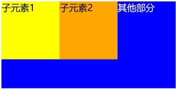
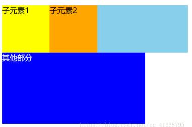
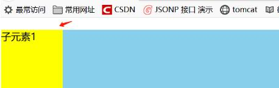
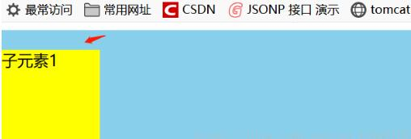
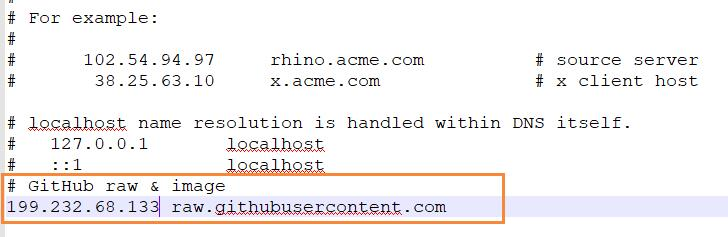

# VUE

## 1. 安装

### 1.1 安装node js和npm

node官网下载，直接安装，npm一起被安装，检查用node -v和npm -v

### 1.2 安装VUE CLI

* vue 3.0 - https://cli.vuejs.org/zh/guide/installation.html
```
npm install -g @vue/cli
```
验证安装查看版本
```
vue -V
```

### 1.3 用webpack创建vue的项目

* vue 3.0 

```
vue create hello-world
```

### 1.4 运行项目

```
cd hello-world
npm run serve
```

打开浏览器 http://localhost:8080

### 1.5 发布前端项目

```
npm run build
```
会在项目目录下生成dist文件夹，将其交给后端进行进一步整合。

如载入别人源代码发布dist，需要先npm install

```
npm install
npm run build
```

## 2. VUE 目录结构

* package.json - 记录项目所有第三方模块依赖

* package_lock.json - 记录项目依赖的版本
* LECENSE - 开源协议的说明
* .eslintrc.js - 检测代码是否规范
* .eslintignore - 检测代码是否规范的豁免
* .editorconfig - 编辑器设置
* .babelrc - VUE单文件组件的写法用babelrc语法解析器，转换成浏览器可解释的代码，babelrc的配置放这个文件中
* .postcssrc.js - postcss的配置项
* static目录下放的是pic等静态资源，一般放第三方的
* node_modules目录下放的是第三方的依赖包
* src目录放整个项目的源代码
    - main.js 整个项目的入口文件
    - App.vue 整个项目的根组件
    - router目录放整个项目的路由
    - components目录放的是项目用的所有小组件
    - assets目录下放的图片类资源 一般放自己的，打包时会压缩，文件路径要用require('')
* config目录放环境配置信息
* build目录放webpack的打包配置项

## 3. VUE基本概念

### 3.1 文件引用顺序

index.html->main.js->App.vue->router-view->/router/index.js->route component-> component->sub component

example -> https://github.com/dtcql/first

### 3.2 零散概念和技巧

* .vue结尾的是单文件组件，与传统vue.component('cname',{})不同 模板在&lt;template&gt;, 逻辑在&lt;script&gt;，样式在&lt;style&gt;中

* 多页应用 - 搜索排名效果好，每个页都加载html    
* 单页应用 - VUE写的是单页应用，前端来做刷页,&lt;router-link&gt;来跳转

* 目录加别名 - webpack.base.conf.js里改resolve,记得要重启服务，例如:
```
  resolve: {
    extensions: ['.js', '.vue', '.json'],
    alias: {
      'vue$': 'vue/dist/vue.esm.js',
      '@': resolve('src'),
      'styles': resolve('src/assets/styles'),
    }
  },
```

## 4. VUE常用第三方工具和文件

### 4.1 Element-UI

VUE最常用的组件库

### 4.2 常用CSS

* reset.css - 确保各浏览器显示基本一致 在main.js中加入    
  import './assets/styles/reset.css'
* border.css - 解决移动端多倍屏边框粗的问题，解决1px像素边框    在main.js中加入import './assets/styles/border.css'
使用时加入class **border-bottom**
```
<li class = "item border-bottom">
```


### 4.3 Fast Click
fast click - 解决某些机型浏览器300ms触发click事件延迟问题    
```
npm install fastclick -- save
```
在main.js中加入import fastClick from 'fastclick'和fastClick.attach(document.body)
* stylus - 可编程css
```
npm install stylus -- save
npm install stylus-loader -- save
```

### 4.4 VUE的图标库 - iconfont
iconfont - 阿里巴巴图标库       
搜索 -> 收藏 -> 项目-> 下载-> iconfont.css放/styles目录下，.eot,.svg,.ttf,.woff放/styles/iconfont目录下-> 改iconfont.css中路径 -> 在main.js中引入iconfont -> 使用时写&lt;span class="iconfont"&gt; 图标6位码&lt;/span&gt; 

### 4.5 轮播图组件 - vue-awesome-swiper
   
Github =》 https://github.com/surmon-china/vue-awesome-swiper
```
npm install vue-awesome-swiper -- save
```
在main.js中加入
```
import Vue from 'vue'
import VueAwesomeSwiper from 'vue-awesome-swiper'
import 'swiper/css/swiper.css'
Vue.use(VueAwesomeSwiper)
```
建立swiper单页面组件，例子=》https://github.com/dtcql/first/blob/master/src/pages/home/components/Swiper.vue

### 4.6 chrome插件 - vue tools
安装vue tools - 我试过的网上用github下载方式安装的都不好用。如下这个网址写的ok =》 https://blog.csdn.net/yizufengdou/article/details/103985709   

步骤一：访问https://chrome.zzzmh.cn/info?token=nhdogjmejiglipccpnnnanhbledajbpd 直接点击推荐下载，相关文件就会下载下来。     

步骤二：将下载的文件进行解压，解压完之后，打开谷歌浏览器，点击右上角 ==》选择更多工具按钮 ==》选择扩展程序，然后将之前解压的Vue.js Devtools_5.3.3_chrome.zzzmh.cn.crx文件拖拽到扩展程序界面，按照对应提示点击确认即可。

备注：如果文件下载失败，可以到这边下载对应文件 https://download.csdn.net/download/yizufengdou/12103493


### 4.7 webpack - 打包工具

## 5. VUE基本语法

### 5.1 axios

axios基于promise，Promise 是异步编程的一种解决方案，其实是一个构造函数，自己身上有all、reject、resolve这几个方法，原型上有then、catch等方法。（ps:什么是原型：https://blog.csdn.net/qq_34645412/article/details/105997336）


```

```

### 5.2 循环遍历

```
<template>
<swiper-slide>
  <div class = "icon" v-for="item of iconList" :key="item.id">
    <div class = "icon-img">
      
    </div>
    <p class="icon-desc">{{item.desc}}</p>
  </div>
</swiper-slide>

<script>
data () {
    return {
      iconList: [{
        id: '0001',
        imgUrl: require('../../../assets/pic/jdmp.png'),
        desc: '景点门票'
      },
      {
        id: '0009',
        imgUrl: require('../../../assets/pic/other.png'),
        desc: '其它地方'
      }]
    }
```

## 6. CSS常用设置

### 6.1 stylus用法

* &lt;style lang="stylus" scoped=""&gt; scoped表示只在本组件中有效

* stylus语法采用2格缩进，子项目缩进2格 

#### 6.1.1 stylus定义变量

定义stylus变量，/src/assets/styles下建立variables.styl文件 并定义变量

```
$bgColor = #00bcd4
```
在使用的component中加入如下代码，CSS引用CSS要加~
```
<style lang="stylus" scoped>
  @import '~@/assets/styles/variables.styl'

  background: $bgColor
```

#### 6.1.2 长字符串text的末尾用。。。表示的方法
    
/styles下建立mixins.styl文件，添加代码
```
ellipsis()
  overflow: hidden
  white-space: nowrap
  text-overflow: ellipsis
```
使用处加，注意有时本身或父级需要加上min-width: 0
```
  @import '~@/assets/styles/mixins.styl'
  .icon-desc
      ellipsis()
```

### 6.2 css用法

#### 6.2.1 flex相关

* float : left 向左浮动，但是flex中不好用，使用flex会使子元素的float、 clear 和 vertical-align 属性失效。

* 父模块中flex布局，flex:1; 就是代表均匀分配元素
```
 .header
    line-height: 2rem
    display: flex
    .header-left
      width: 2rem
    .header-input
      flex: 1
    .header-right
      width: 4rem
```

#### 6.2.2 大小设置相关

* 单位一般用rem，1rem等于一个字的大小，即html里的fontsize

* font-size : 设置字体大小

#### 6.2.3 宽高设置相关

* width : 3rem 设置宽度, height : 3rem 设置高度， width: 25%

* 常用的设置宽高比方法 
```
    overflow : hidden
    width :100%
    height : 0
    padding-bottom : 25.2%
```

* height与line-height，height是整个元素（div，img）的高度，line-height是单行高度，如line-height为20px，那么两行的话，那么div的实际高度为40px。

* margin-top : .2rem设置上边距 一般与height，margin-bottom合用， margin-left 与width，margin-right合用 

#### 6.2.4 对齐设置相关

* 设置对齐 text-align : center     
  子区块居中对齐 
  ```    
  display : block
  margin : 0 auto
  ```

* 注意父子标签的相对位置 position : relative/absolute
下面例子表明icon-img的位置是在icon范围之内的
```
    .icon
      position: relative
      overflow: hidden
      float: left
      width: 25%
      padding-bottom : 25%
      .icon-img
        position: absolute
        top: 0
        left : 0
        right : 0
        bottom : 1rem
        box-sizing : border-box
        padding : .1rem
```

#### 6.2.5 边距设置相关

margin - 外边距 ； padding - 内边距

* padding-left : .2rem设置左侧内边距    

* box-sizing 
   
  - content-box  是默认值。任何边框和内边距的宽度不包含在width内，都会被增加到最后绘制出来的元素宽度中。  

  - border-box 告诉浏览器：你想要设置的边框和内边距的值是包含在width内的。

  设置一圈内边距
  ```
   box-sizing : border-box
   padding : .1rem
  ```

#### 6.2.6 样式穿透 - 选择父组件下面的所有子组件

```
  .wrapper >>> .swiper-pagination-bullet-active
  background: white
```

#### 6.2.7 overflow:hidden

* 溢出隐藏    
给一个元素中设置overflow:hidden，那么该元素的内容若超出了给定的宽度和高度属性，那么超出的部分将会被隐藏，不占位。

* 清除浮动    
一般而言，父级元素不设置高度时，高度由随内容增加自适应高度。当父级元素内部的子元素全部都设置浮动float之后，子元素会脱离标准流，不占位，父级元素检测不到子元素的高度，父级元素高度为0。

   

  由于父级元素没有高度，下面的元素会顶上去，造成页面的塌陷。因此，需要给父级加个overflow:hidden属性，这样父级的高度就随子级容器及子级内容的高度而自适应。

   

* 解决外边距塌陷

  父级元素内部有子元素，如果给子元素添加margin-top样式，那么父级元素也会跟着下来，造成外边距塌陷

  

  给父级元素添加overflow:hidden，就可以解决这个问题了。

  

#### 6.2.8 小技巧

* 弧边输入框/像素圆角 border-radius: .5rem

  

## 7. webpack设置

### 7.1 webpack


# Github

## 1. 常见问题

1.1 Github上文件不显示，文件图标断裂

去https://www.ipaddress.com/查raw.githubusercontent.com的ip
加新ip加入/修改到host文件中  
Win：C:\Windows\System32\drivers\etc\hosts  
Mac: /etc/hosts    



